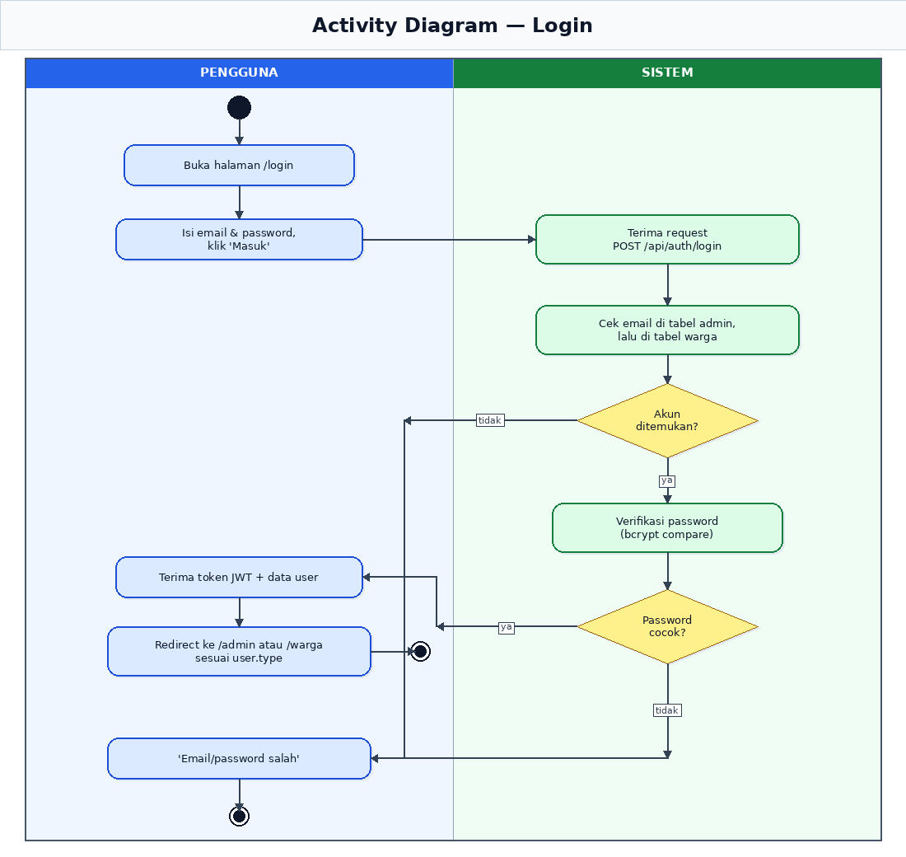
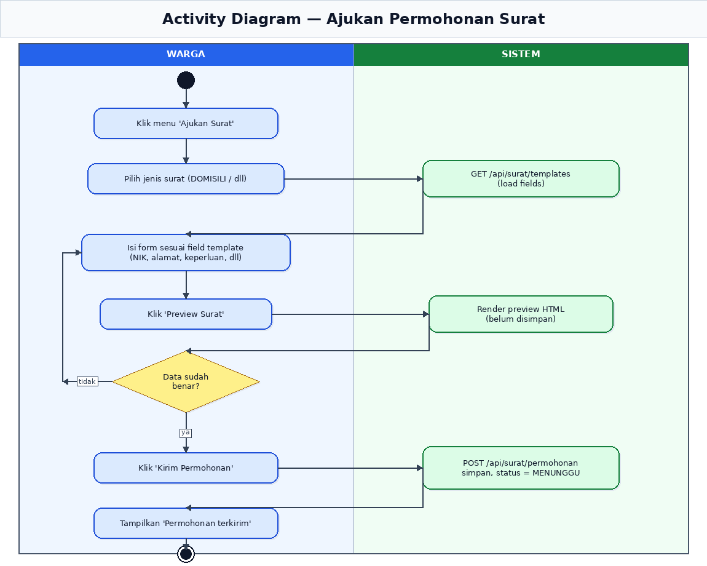
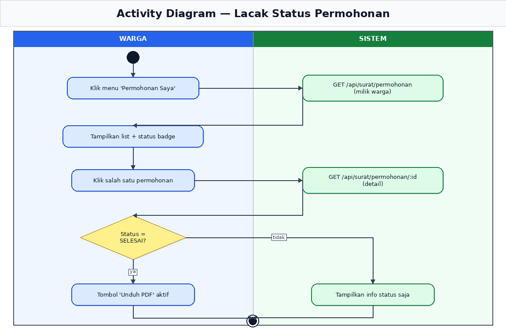
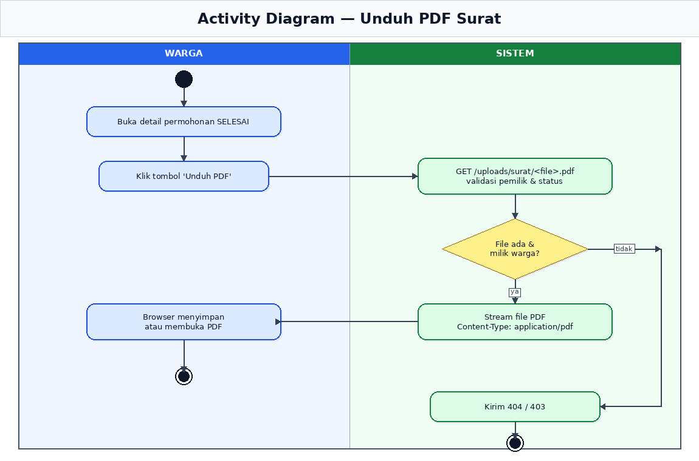
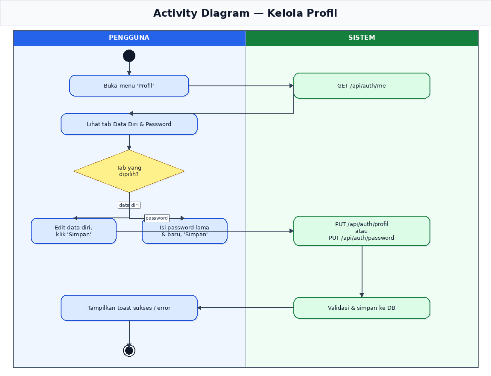
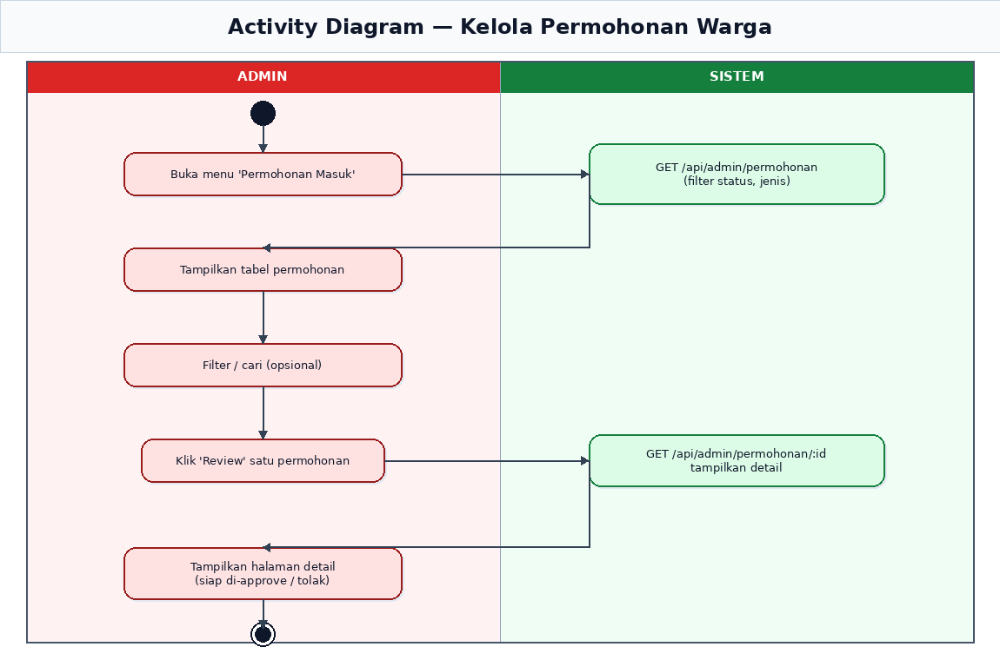
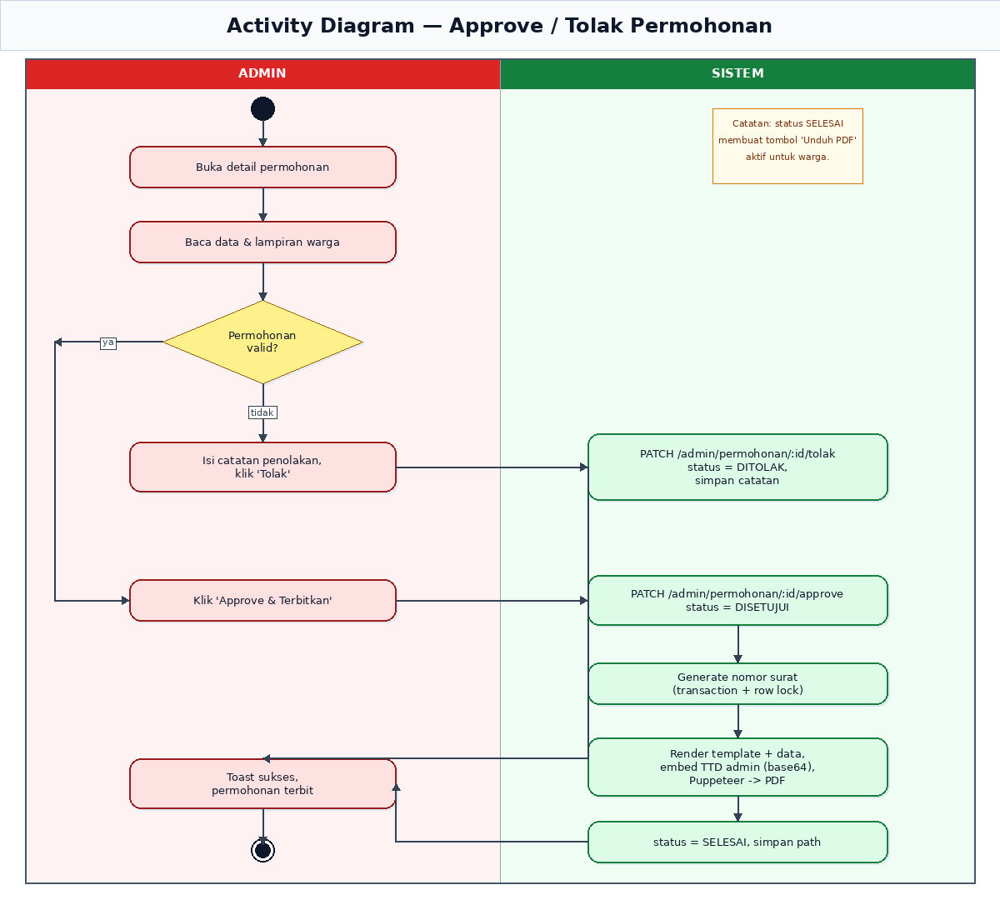
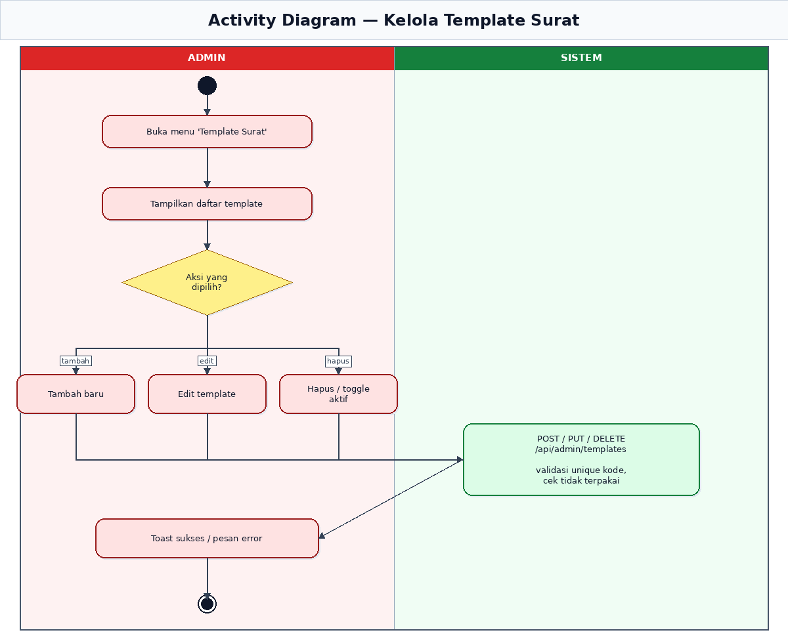
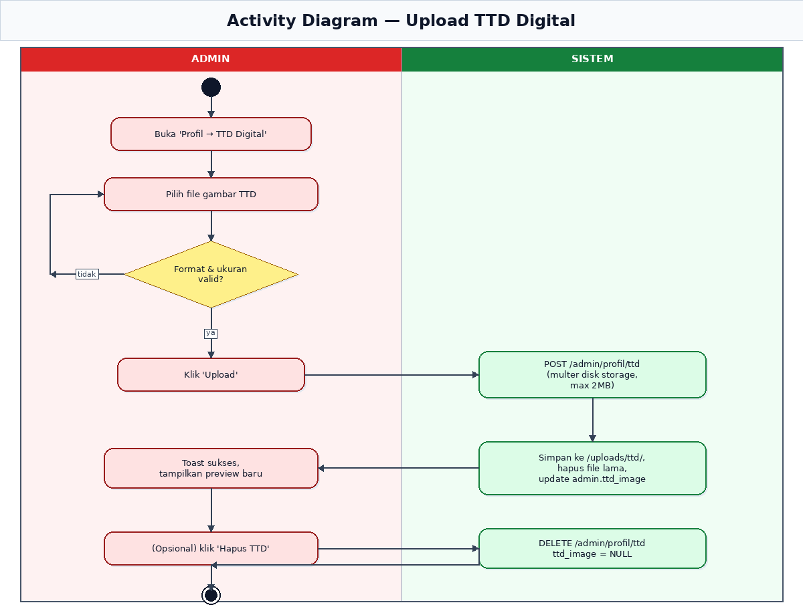
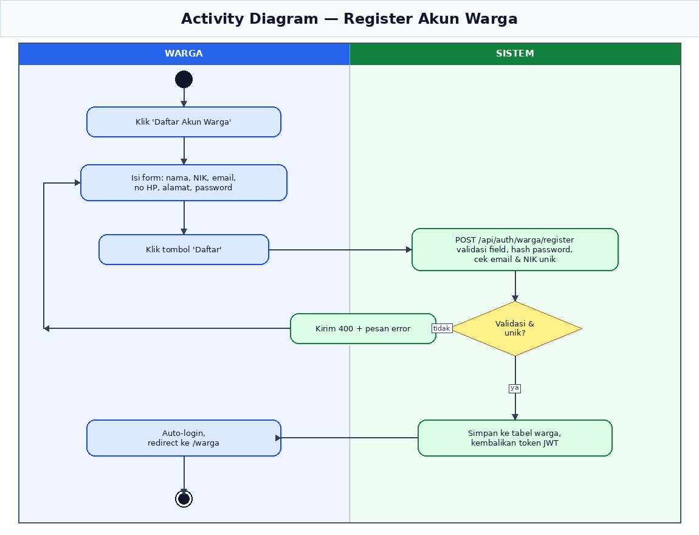

# Activity Diagram per Use Case — e-Surat Desa

Dokumen ini berisi *activity diagram* (flowchart UML) untuk setiap *use case*
utama pada aplikasi **e-Surat Desa**. Tiap diagram memakai **swimlane**
(kolom kiri = aktor, kolom kanan = sistem) sehingga jelas siapa yang
mengerjakan apa.

## Legenda

| Simbol | Arti |
|---|---|
| Lingkaran hitam pekat | Start node (mulai) |
| Lingkaran hitam dengan ring putih | End node (selesai) |
| Rounded rectangle | Aktivitas / langkah |
| Diamond kuning | Decision (percabangan) |
| Garis dengan panah | Aliran kontrol (control flow) |
| Label `ya` / `tidak` | Cabang dari decision |

Warna node mengikuti aktor:
- **Biru** — Warga
- **Merah** — Admin
- **Hijau** — Sistem (proses internal)

---

## Daftar Diagram

| # | Use Case | File |
|---|---|---|
| 1 | Login (terpadu, auto-detect role) | [01-login.png](./activities/01-login.png) |
| 2 | Ajukan Permohonan Surat | [02-ajukan-permohonan.png](./activities/02-ajukan-permohonan.png) |
| 3 | Lacak Status Permohonan | [03-lacak-status.png](./activities/03-lacak-status.png) |
| 4 | Unduh PDF Surat | [04-unduh-pdf.png](./activities/04-unduh-pdf.png) |
| 5 | Kelola Profil | [05-kelola-profil.png](./activities/05-kelola-profil.png) |
| 6 | Kelola Permohonan Warga (admin) | [06-kelola-permohonan.png](./activities/06-kelola-permohonan.png) |
| 7 | Approve / Tolak Permohonan (admin) | [07-approve-tolak.png](./activities/07-approve-tolak.png) |
| 8 | Kelola Template Surat (admin) | [08-kelola-template.png](./activities/08-kelola-template.png) |
| 9 | Upload TTD Digital (admin) | [09-upload-ttd.png](./activities/09-upload-ttd.png) |
| 10 | Register Akun Warga | [10-register.png](./activities/10-register.png) |

---

## 1. Login

Endpoint terpadu `POST /api/auth/login` mendeteksi role secara otomatis:
sistem mengecek email di tabel `admin` dulu, lalu di tabel `warga`. Jika
password cocok, server mengembalikan token JWT + data user, dan frontend
mengarahkan ke `/admin` atau `/warga` sesuai `user.type`.

## 2. Ajukan Permohonan Surat

Warga memilih jenis surat, mengisi form sesuai field template, melakukan
preview, lalu mengirim. Sistem menyimpan data ke tabel `permohonan_surat`
dengan status `MENUNGGU`. Jika data masih salah saat preview, warga bisa
kembali memperbaiki form (loop balik).

## 3. Lacak Status Permohonan

Warga melihat daftar permohonannya, memilih satu, lalu sistem menampilkan
detail. Tombol *Unduh PDF* hanya aktif jika status sudah `SELESAI`.

## 4. Unduh PDF Surat

Sistem memvalidasi bahwa PDF benar-benar milik warga yang sedang login dan
status permohonan adalah `SELESAI`. Jika valid, file di-stream dengan
`Content-Type: application/pdf`. Selain itu, sistem mengembalikan 404/403.

## 5. Kelola Profil

Tersedia untuk warga maupun admin. Tab *Data Diri* dan tab *Password*
memakai endpoint berbeda (`PUT /api/auth/profil` dan `PUT /api/auth/password`).
Khusus admin, tersedia tab tambahan **TTD Digital** (lihat use case 9).

## 6. Kelola Permohonan Warga (admin)

Admin membuka daftar permohonan masuk, dapat memfilter berdasarkan status
atau jenis, lalu mengklik *Review* untuk melihat detail. Halaman detail
inilah pintu masuk ke proses Approve/Tolak (use case 7).

## 7. Approve / Tolak Permohonan (admin)

Inti dari sistem. Saat admin meng-approve, sistem otomatis:
1. Generate **nomor surat** dengan transaction + row lock (mencegah duplikat).
2. Render template HTML + data warga, sisipkan TTD digital admin (jika ada)
   sebagai base64.
3. Konversi ke PDF dengan **Puppeteer**.
4. Simpan path PDF, set status menjadi `SELESAI`.

Jika ditolak, admin wajib mengisi catatan; status menjadi `DITOLAK`.

## 8. Kelola Template Surat (admin)

Admin dapat menambah, mengedit, atau menghapus/menonaktifkan template.
Sistem memastikan kode template unik dan template yang masih dipakai
permohonan aktif tidak boleh dihapus.

## 9. Upload TTD Digital (admin)

Admin mengunggah gambar TTD (PNG/JPG/JPEG/WEBP, maks 2MB). Sistem
memvalidasi format & ukuran, menyimpan ke `backend/uploads/ttd/`,
menghapus file lama jika ada, lalu memperbarui kolom `admin.ttd_image`.
TTD ini akan otomatis disisipkan ke PDF surat berikutnya saat di-approve.

## 10. Register Akun Warga

Hanya tersedia untuk warga. Sistem memvalidasi field, mem-hash password
dengan bcrypt, dan memastikan email & NIK unik. Setelah berhasil, warga
otomatis ter-login dan diarahkan ke dashboard `/warga`.

---

## Catatan Implementasi

- Semua endpoint admin berada di prefix `/api/admin/...` dan dilindungi
  middleware `verifyAdmin`.
- Endpoint warga berada di `/api/surat/...` dan `/api/auth/...` dengan
  middleware `verifyWarga` di mana relevan.
- PDF disimpan di `backend/uploads/surat/` dan disajikan secara statis
  via `app.use('/uploads', express.static(...))`.
- TTD admin disimpan di `backend/uploads/ttd/` dan disajikan dari path
  yang sama.
