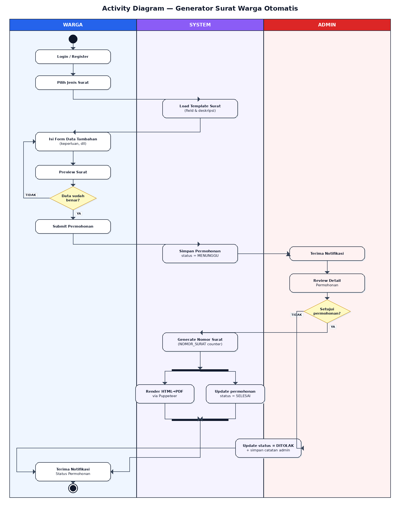

# Activity Diagram

## Alur

### Warga
1. Login / Register
2. Pilih jenis surat → sistem load template
3. Isi form data tambahan
4. Preview surat
5. Konfirmasi data benar → Submit
6. Tunggu notifikasi status

### System
- Simpan permohonan (status = MENUNGGU)
- Generate nomor surat saat approve
- Generate PDF (Puppeteer)
- Update status (SELESAI / DITOLAK)

### Admin
1. Terima notifikasi
2. Review detail permohonan
3. Pilih: Approve atau Tolak (+ catatan)
