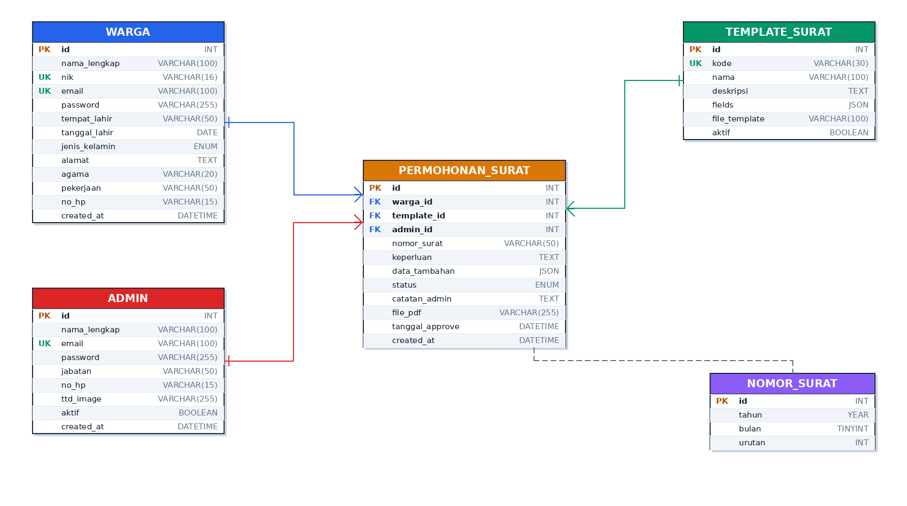

# Entity Relationship Diagram

## Tabel

### `warga` — akun pemohon surat
- `id` PK
- `nama_lengkap`, `nik` UK, `email` UK, `password` (bcrypt)
- `tempat_lahir`, `tanggal_lahir`, `jenis_kelamin`
- `alamat`, `agama`, `pekerjaan`, `no_hp`

### `admin` — akun pengurus desa/RT/RW
- `id` PK
- `nama_lengkap`, `email` UK, `password` (bcrypt)
- `jabatan` (Ketua RT, Sekretaris, dll)
- `no_hp`, `ttd_image`, `aktif`

### `template_surat`
- `id` PK, `kode` UK, `nama`, `deskripsi`
- `fields` JSON (definisi form input)
- `file_template`, `aktif`

### `permohonan_surat`
- `id` PK
- `warga_id` FK → `warga.id`
- `template_id` FK → `template_surat.id`
- `admin_id` FK → `admin.id` (nullable)
- `nomor_surat`, `keperluan`, `data_tambahan` JSON
- `status` ENUM
- `catatan_admin`, `file_pdf`, `tanggal_approve`

### `nomor_surat` — sequence helper
- `id` PK, `tahun`, `bulan`, `urutan`
- UK composite (tahun, bulan)

## Relasi

| Dari | Ke | Kardinalitas |
|---|---|---|
| `warga` | `permohonan_surat` | 1 : N |
| `template_surat` | `permohonan_surat` | 1 : N |
| `admin` | `permohonan_surat` | 1 : N |
