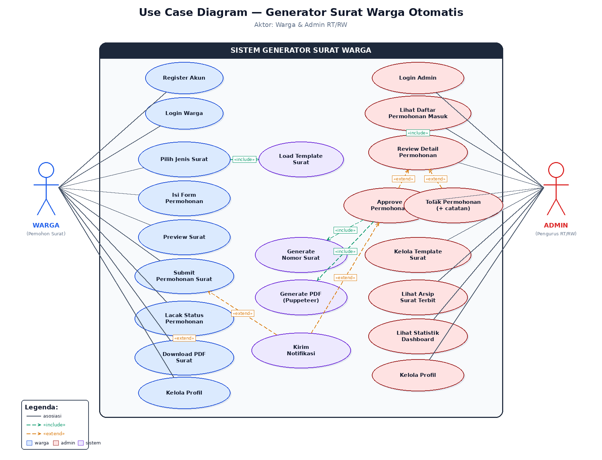

# Use Case Diagram

## Aktor

- **Warga** — pemohon surat
- **Admin** — pengurus RT/RW

## Use Cases (utama)

### Warga
- Register Akun, Login Warga
- Pilih Jenis Surat
- Isi Form Permohonan, Preview Surat
- Submit Permohonan, Lacak Status
- Download PDF Surat
- Kelola Profil

### Admin
- Login Admin
- Lihat Daftar Permohonan, Review Detail
- Approve / Tolak Permohonan
- Lihat Arsip Surat, Lihat Statistik
- Kelola Profil

### Sistem (otomatis)
- Load Template Surat
- Generate Nomor Surat
- Generate PDF (Puppeteer)
- Kirim Notifikasi
